# VAYU-SARTHI: Plan of Action

**SIH 2026 · PS 26250 · Air Power: Dynamic Air Operations & Resource Optimisation**
MoD / Defence Services Staff College · Software · Transportation & Logistics

> *Sarthi* = charioteer. Arjuna fights; the charioteer reads the battlefield, sees options and
> advises. VAYU-SARTHI is the planner's charioteer. It fuses the picture, predicts what is about
> to break, computes the best re-plan in seconds and explains it. **The commander decides.**

---

## 0. TL;DR

Most teams will build a dashboard with some ML bolted on. We are building a **decision engine
with a dashboard on top**. Four things make it different, and the first three already run in
this repo (`engine/`):

1. **Minimal-disruption retasking.** When something changes, we don't regenerate the ATO. We compute the
   *smallest set of changes* that recovers the most mission value, and show it as a reviewable
   "diff" of the plan. Measured on 8 scenarios: **66% fewer aircraft reassignments than a re-plan
   from scratch (12.8 vs 37.5), in 1.7 s, with almost no loss of mission value.**
2. **One integrated model, not seven silos.** Aircraft, crew fatigue, weapons, tankers, weather,
   threats, airspace and alert reserves are all in a single optimisation, so cascades are handled
   automatically. A pop-up SAM triggers a reroute, which lengthens the route, which needs a
   tanker, which comes from a lower-priority package.
3. **Explainable by construction.** Every unplanned mission and every change carries a reason, e.g.
   *"Least-risk route is 33% vs acceptable 30%; a SEAD package would open options."*
4. **Predict → act early.** Fog forecasts, maintenance analytics, intel age and crew fatigue feed the
   optimiser *before* the disruption hits. Combined with offline/DDIL operation, air-gapped AI and
   human-in-the-loop approval, it is something the IAF could plausibly field.

Measured against a greedy "manual planner" baseline over 20 random scenarios (33–39 missions,
96 aircraft, ~160 crews): **+12.4 pts priority-weighted mission fulfilment (85.1% → 97.5%)
and +15.4 pts expected mission value**. Every plan passes an independent constraint checker.

---

## 1. Do this first: where you are in the SIH timeline

Today is **7 Oct 2026**. Public sources say SIH 2026 launched on 21 Aug 2026 and closed idea
submission in September. Sources differ on the exact date (11 Sep vs 30 Sep). Online evaluation
and shortlisting run **Oct–Nov**, and the **36-hour Grand Finale is in December 2026**
([reskilll guide](https://blogs.reskilll.com/smart-india-hackathon-2026-launched-timeline-registration-how-to-participate/),
[BCREC SIH page](https://bcrec.ac.in/sih)).

- **If your idea PPT is already submitted:** use the next 8 weeks to build the prototype (§9).
  Shortlisting is often checked against a demo video or prototype screenshots, so get §8's working
  slice on screen early.
- **If your institute's deadline is still open:** use §12 for slide content. Download the
  *official* template from sih.gov.in. Blogs disagree on whether it is 6 slides (Title / Solution /
  Technical approach / Feasibility / Impact / References) or longer. Follow the portal.
- Verify team rules on the portal: 6 members from one institute, at least 1 woman, mentors allowed.

---

## 2. Understand the problem the way a planner does

Problem understanding is weighted around 20% in evaluation. Judges from DSSC will be serving officers, so
speak their language.

### 2.1 The air tasking cycle and where the hours go

```
Guidance & objectives -> Target development -> Weaponeering & allocation -> ATO/ACO production
        ^                                                                          |
        +---------------- Assessment (BDA) <---------------- Execution <-----------+
```

- The **ATO** (air tasking order) assigns every sortie: mission, aircraft, base, time on target (TOT), weapons,
  tanker, callsign. The **ACO** (airspace control order) deconflicts airspace. The **MAAP**
  (master air attack plan) is where packages are built. Classic cycles run around 72 h.
- The slow, error-prone step is **allocation and synchronisation**. Planners cross-check maintenance
  status, crew rest and qualifications, weapon stocks per base, weather at launch and recovery,
  threat envelopes, tanker tracks and civil airspace (India runs **Flexible Use of Airspace**). Each check
  lives in a different system.
- **Dynamic retasking** is the hard part. One event ripples: a fogged-in base strands its sorties.
  Moving them to another base changes routes, fuel, tanker needs and crew duty, and consumes that
  base's weapons and alert reserve. A human can do this for one event, but not for five events an
  hour while keeping the rest of the plan stable. **Stability matters**: crews are briefed and
  weapons are loaded, so a "better" plan that changes everything is a worse plan.

### 2.2 The seven data silos named in the PS, and what each means to the optimiser

| PS input | What it constrains | How we model it |
|---|---|---|
| Aircraft availability | Which tails can fly, and when | Serviceability probability per tail, `available_from`, turnaround times |
| Crew status | Who can fly, and when | Type qualification, night currency, fatigue-based fit windows, sortie and flight-time limits, rest |
| Weapon loads | What each sortie can achieve | Stocks per base × category, carriage limits per type |
| Airspace | Where routes can go | Restricted/FUA zones blocked in the routing graph |
| Weather | When bases can launch/recover | Closure windows (forecast) remove TOTs whose launch or recovery falls inside |
| Threats | Route risk, feasibility, sequencing | SAM envelopes → hazard field; risk ceilings; SEAD → suppression |
| Mission priorities | What to save when you can't do everything | Priority-weighted objective, dependencies, alert-reserve floors |

### 2.3 Success metrics (use these words on every slide)

- **Time-to-plan / time-to-retask** (hours → seconds)
- **Priority-weighted mission fulfilment** and **expected mission value** (which also accounts for serviceability and attrition risk)
- **Plan stability**: sorties changed per retask
- **Risk exposure**: mean and max sortie loss probability
- **Resource efficiency**: sorties used, tanker sorties, alert reserve maintained
- **Explainability coverage**: % of decisions with a stated reason (target: 100%)

---

## 3. The solution: VAYU-SARTHI

**One line:** a real-time, explainable decision-support system. It fuses air-ops data into one
living picture, predicts disruptions and generates optimal, *minimally disruptive* air tasking
plans and retasking options in seconds, for a commander to approve.

### 3.1 The loop (OODA, made computable)

```
 OBSERVE                ORIENT                        DECIDE                         ACT
 data adapters  ->  fused world state  ->  predictive layer  ->  optimiser + explainer  ->  commander approves
 (MX, crew, armt,   (single source of     (serviceability,       (plan / retask diff /      -> ATO change orders
  met, intel, ACO)   truth + freshness)    fog, fatigue, threat)   3 COAs + reasons)         -> audit log
        ^                                                                                         |
        +----------------------------- execution feedback & events -------------------------------+
```

### 3.2 Five screens

1. **Common Operational Picture (map).** Bases colour-coded by readiness. Threat domes, with a blurred
   ring showing intel-age uncertainty. Routes coloured by risk. Weather and restricted airspace overlays. Time slider.
2. **ATO synchronisation matrix (Gantt).** Lanes per aircraft, crew and tanker. Packages, TOTs,
   conflicts and alert-reserve floor.
3. **Retask console.** Event feed → proposed diff (ADDED / DROPPED / MODIFIED with reasons) →
   "a naive re-plan would change N" → **Approve / Modify / Reject**. Includes a COA comparison (3 options).
4. **Readiness board.** Predicted serviceable aircraft per base per hour, a crew-fitness heatmap,
   weapon stocks with burn-down, and a freshness badge on every data source.
5. **Copilot panel.** Natural-language questions answered by calling the engine, for example *"What breaks if Halwara
   fogs in at 0500?"* or *"Why isn't STK-06 planned?"*. The LLM never decides.

---

## 4. What makes it unique (innovation is ~25% of the score)

| Differentiator | Typical hackathon entry | VAYU-SARTHI |
|---|---|---|
| Retasking | Re-run the whole planner; the plan changes everywhere | **Churn-penalised re-optimisation**. Changes cost more the closer to launch (planned ×1, crews briefed ×3, aircraft armed ×8); launched missions are frozen. Output is a reviewable diff. |
| Coupling | Separate modules for routes, crew, weapons | **One CP-SAT model**: routing ↔ range ↔ tanker ↔ crew duty ↔ weapons ↔ weather ↔ alert reserve |
| Explainability | "AI says so" | Reason codes on every rejected option, plus counterfactual hints ("risk 33% vs 30% → add SEAD") |
| Time awareness | Static threat circles | **Intel-age inflation**: a mobile SAM's envelope grows with time since it was last seen, and its lethality spreads out |
| Robustness | One plan, no confidence | **Monte Carlo stress test** (p05/p50/p95 fulfilment) and single points of failure |
| Prediction | Charts | Predictions **feed the optimiser** (fog closure windows, maintenance risk, fatigue windows), so retasking is proactive |
| Deployability | Cloud + public LLM API | **Air-gapped**: offline maps, local open-weight LLM, DDIL edge nodes, audit trail, human approval |
| Dual-use | Combat only | Same engine plans **HADR / logistics airlift** (fits the Transportation & Logistics theme) |

**Positioning against real systems.** The USAF's Kessel Run tools (Slapshot for MAAP, KRADOS replacing
TBMCS) digitised ATO workflow ([Air & Space Forces](https://www.airandspaceforces.com/afcent-can-now-generate-air-tasking-orders-in-the-cloud/)).
DARPA's ACK programme targets exactly our problem: a *decision aid to rapidly task and retask
assets* ([DARPA ACK](https://www.darpa.mil/research/programs/adapting-cross-domain-kill-webs)).
In India, the IAF is adding AI decision-support tools to IACCS for air battle managers under its
UDAAN digitisation drive ([IDRW](https://idrw.org/?p=383033)). VAYU-SARTHI is an indigenous,
explainable, offline-capable take on that need.

---

## 5. Architecture

```mermaid
flowchart LR
  subgraph Sources["Data sources (adapters)"]
    MX[Maintenance / MX logs]
    CR[Crew rosters & sleep logs]
    AR[Armament stocks]
    MET[Met: Open-Meteo, METAR/TAF]
    INT[Intel: threats, tracks]
    ACO[Airspace / FUA / NOTAM]
    TSK[Taskings & priorities]
  end
  Sources --> BUS[(Event bus<br/>NATS JetStream)]
  BUS --> FUSE[Fusion & data-trust layer<br/>entity resolution, freshness, conflicts]
  FUSE --> STATE[(Fused world state<br/>Postgres + PostGIS)]
  STATE --> PRED[Predictive layer<br/>serviceability, fog go/no-go,<br/>fatigue, threat evolution, consumption]
  PRED --> ENG
  STATE --> ENG[Decision engine<br/>routing + CP-SAT allocation<br/>+ retask + COA + stress test]
  ENG --> EXP[Explainer<br/>reason codes, counterfactuals]
  EXP --> API[FastAPI + WebSocket]
  API --> UI[React UI: COP map, Gantt,<br/>retask console, readiness]
  API --> LLM[Copilot: local LLM<br/>tool-calls engine API]
  UI -->|approve / reject| AUD[(Audit log<br/>hash-chained)]
  AUD --> BUS
```



| Layer | Choice | Why |
|---|---|---|
| Optimisation | **Google OR-Tools CP-SAT** (built) | Best open-source solver for scheduling and assignment with interval variables. Proves feasibility, gives an optimality gap, supports warm starts. |
| Numerics / routing | NumPy + SciPy sparse Dijkstra (built) | Vectorised grid, ~20k nodes, all-base routes per target in milliseconds |
| API | FastAPI + WebSocket (REST built) | Typed (pydantic), async, auto docs at `/docs` |
| Event bus | NATS JetStream | Lightweight; *leaf nodes* run at the edge and sync when links return (DDIL) |
| Store | PostgreSQL + PostGIS (SQLite is fine for the finale) | Spatial queries, audit tables |
| ML | scikit-learn / LightGBM, lifelines (survival) | Small, explainable, CPU-only |
| Fusion (stretch) | [Stone Soup](https://stonesoup.readthedocs.io) (UK DSTL, open source) | Multi-sensor Kalman/JPDA tracking out of the box |
| Map | MapLibre GL + deck.gl, **PMTiles offline tiles** | Fully offline, WebGL, 3D threat domes |
| Gantt | vis-timeline (or custom D3) | Thousands of bars, drag to edit |
| Copilot | Open-weight LLM via Ollama / llama.cpp, tool-calling | Runs air-gapped; answers only through engine tools |
| Deploy | Docker Compose, single laptop | Demo-proof, offline |

---

## 6. Algorithms

### 6.1 Fused world state and data trust
Everything the planner needs lives in one typed `World` object (`engine/sarthi/models.py`). For production,
each fact also carries `source`, `observed_at` and `confidence`. The fusion layer:
- resolves entities across systems, e.g. tail `HLW-SU30-07` in the MX log = the same tail in the squadron board;
- flags **conflicts** (MX says serviceable, squadron reports a snag) for a human to resolve;
- discounts **stale** data: effective availability = p × e^(−age/τ). A freshness badge per source tells
  the commander how much to trust the plan.

### 6.2 Feasibility screening and TOT domains (built: `candidates.py`)
For every (mission, aircraft) pair we compute route, transit, launch lead and recovery trail, and
the **set of allowed TOTs**. That set is the mission window, minus TOTs before the aircraft can launch, minus TOTs whose
launch or recovery falls in a base closure. Crews get their own domain: TOTs where predicted
effectiveness is at or above the threshold at both TOT and recovery, and daylight-only crews never fly at night. Every rejection
increments a **reason code**. This keeps the optimiser lean and makes "why not?" answerable.

### 6.3 Allocation model (built: `optimizer.py`)
Decision variables: `u_m` (mission flown), `tot_m` (time on target), `x_{m,a}` (aircraft a on m),
`y_{m,c}` (crew c on m), `k_{m,t}` (tanker t supports m).

```
maximise   Σ 1000·priority_m·u_m  +  Σ (quality_{m,a} − sortie_cost)·x_{m,a}  +  Σ fitness_bonus·y_{m,c}
           − churn penalties (retask mode)

s.t.  Σ_a x_{m,a} = package_m · u_m                         (airlift: Σ payload·x ≥ cargo·u_m)
      x_{m,a} ⇒ tot_m ∈ Domain_{m,a}                       (availability, weather/attack closures)
      y_{m,c} ⇒ tot_m ∈ Domain_{m,c}                       (fatigue, night currency)
      Σ x in (m, base, type) = Σ y in (m, base, type)      (a fit crew per aircraft)
      NoOverlap(aircraft intervals [launch, recover + turnaround])  per tail
      NoOverlap(crew intervals [brief, debrief + rest])             per crew;  sorties & flight-minute caps
      Σ weapons used at base b of category w ≤ stock_{b,w}
      receivers needing AAR ≤ Σ capacity·k_{m,t};  tanker intervals NoOverlap
      Cumulative(fighter intervals at base b) ≤ fighters_b − alert_reserve_b
      u_m ⇒ u_dep ∧ lag_min ≤ tot_m − tot_dep ≤ lag_max   (SEAD before strike)
```
Quality favours aircraft likely to be serviceable and survivable, and nearer bases. The sortie cost stops the solver
padding packages. The greedy baseline is used as a warm-start hint, so the optimiser is never worse than it.

### 6.4 Minimal-disruption retasking (built: `retask.py`)
- Missions already launched are **frozen**. Their resources are held as fixed intervals.
- For every not-yet-launched mission in the old plan, keeping an aircraft earns `300·w` and adding a
  new one costs `100·w`. Keeping a crew earns `100·w`, and each minute of TOT shift costs `2·w`. Here
  `w ∈ {1, 3, 8}` for >6 h / 2–6 h / <2 h to launch.
- Output is a **PlanDiff**: per mission ADDED / DROPPED (with reasons) / MODIFIED (+/− tails, crew
  changes, TOT shift, reroutes, tanker changes), alongside what a naive re-plan would have changed.
- **Scaling (next):** Large Neighbourhood Search. Re-solve only missions that share resources with
  the event (k-hop neighbourhood), fix the rest, and iterate. Keeps retask under 5 s at 300+ missions.

### 6.5 Threat-aware routing (built: `threats.py`)
- Grid at 0.1° over the theatre, 8-connected. Each SAM adds hazard rate `−ln(1−Pk)/(2r)` per km
  inside its envelope, so a full crossing gives Pk. Two-way route risk = `1 − exp(−2·∫hazard)`.
- Edge cost = km + β·hazard. Dijkstra from each target to all bases at once gives the risk-vs-distance trade-off.
- **Intel-age inflation:** radius grows with `mobile_speed × age` (capped at 1.5×), and lethality is spread
  over the larger area. Old intel becomes a wider, fainter threat.
- **SEAD coupling:** a strike that depends on a SEAD mission is routed with the suppressed SAM's
  Pk ×0.25, which is why the solver schedules SEAD 5–30 min before the strike.
- Restricted airspace (civil terminal areas / FUA) is blocked from the graph.
- **Any-angle smoothing (built):** after Dijkstra, string pulling replaces grid zig-zags with straight
  legs wherever a leg costs no more (km + β·hazard) than the grid path and avoids restricted airspace.
  Risk and distance are recomputed on the smoothed path, so the numbers stay honest.
- **Next:** terrain masking. Compute radar viewsheds from SRTM / Copernicus GLO-30 DEM at 3 altitude bands
  and do a 3-D layered search. Low-level ingress lowers detection but burns more fuel, which couples back
  into range and tanker needs.

### 6.6 Predictive layer
| Model | Method | Output into optimiser | Data |
|---|---|---|---|
| Aircraft serviceability (MX) | Survival / gradient boosting on hours since inspection, sorties in the last 72 h, snag history | `p_serviceable`, `available_from`; alerts trigger proactive retask | Synthetic logs; NASA C-MAPSS turbofan data to show RUL modelling |
| Weather go/no-go | Ensemble probability that ceiling/visibility falls below minima at launch/recovery | Base closure windows with probability | Open-Meteo (incl. ensembles), METAR/TAF from aviationweather.gov |
| Crew fatigue (built) | Two-process model (Borbély): homeostatic S + circadian C → effectiveness % | Fit TOT windows per crew | Rosters, sleep logs; swap in SAFTE (open via the SAFTEr R package) |
| Threat evolution (built, simple) | Intel-age envelope growth; next: KDE heatmap of pop-up likelihood | Hazard field | Synthetic intel |
| Consumption & resupply | Weapon/fuel burn-down per base | Auto-generated airlift missions to restock forward bases | Plan output |

**North-India winter fog** is real and topical for a December demo. A model that forecasts a base closure
three hours ahead, plus a retask diff, is the strongest "predictive analytics" story you can tell.

### 6.7 Explainability (built: `explain.py`)
- **Reason codes** for each screened-out option, aggregated per mission.
- **Competition** explanation: "11 of 52 feasible aircraft are committed to STK-03 (P8)…".
- **Counterfactual hints**: least-risk route vs ceiling, stock exhausted at which bases, tanker bottleneck.
- **Next:** CP-SAT assumption literals to extract a *minimal set of constraints* blocking a mission
  (an unsat core), and "what would it take" queries such as re-solving with +1 tanker or risk ceiling +5%.

### 6.8 Robustness stress test (built: `kpi.stress_test`)
Execute the plan 2,000 times with random unserviceability and attrition. Report the p05/p50/p95
fulfilment band, the most fragile missions and the most relied-on assets. **Next:** a robust mode that
adds spare aircraft for high-priority packages when p05 is too low.

### 6.9 Courses of action (next)
Solve 3 times with different objective weights to get **Max-Effect**, **Min-Risk** and **Max-Reserve**
options (an ε-constraint Pareto set). Show them side by side: fulfilment, risk, reserve, sorties.
A **commander's-intent slider** for risk appetite and reserve level re-solves live.

### 6.10 Copilot (next)
A local open-weight LLM with tools `get_plan`, `why_not(mission)`, `what_if(events)`,
`compare_coas`, `brief(mission)`. Optional RAG over *public* doctrine documents for terminology. Guardrails:
the LLM can only read and propose; every state change goes through the approval workflow; all
prompts and tool calls are logged.

---

## 7. Data strategy: synthetic core, real public feeds at the edges

Use **no classified or sensitive data**. Base coordinates are public. Fleet, stocks, crews, threats and
targets are **notional and randomly generated** (`scenario.py`). Label the scenario "Exercise – notional
data" in the UI. Real feeds make it feel live:

| Feed | Source | Use |
|---|---|---|
| Weather forecast + ensembles | [Open-Meteo](https://open-meteo.com) (free, no key) | Fog/ceiling probability → closure windows |
| METAR/TAF | [aviationweather.gov API](https://aviationweather.gov/data/api/) | Live observations at Indian airfields (e.g. VIDP) |
| Civil traffic | [OpenSky Network](https://opensky-network.org) REST (bbox query) | Airspace deconfliction layer, fusion demo |
| Terrain | SRTM / Copernicus GLO-30 DEM | Terrain masking, radar horizon |
| Airspace | AAI eAIP (public) | Restricted areas, civil terminal areas |
| Engine degradation | NASA C-MAPSS | Remaining-useful-life model for the MX demo |

Ship every real feed with a cached snapshot, so the demo never depends on venue Wi-Fi.

---

## 8. What is already built (in this repo)

Run everything with `./run.sh`, then open http://127.0.0.1:8000. It works offline on one laptop.

**UI (`frontend/`, React + deck.gl, verified end-to-end in a browser):**

| Screen | What it shows |
|---|---|
| COP map | Offline basemap with India's boundary as officially depicted; bases by readiness status; SAM envelopes with intel-age halos; optional threat surface; routes and objectives by mission family; tanker tracks; aircraft moving along routes with the timeline cursor; click-to-drop a pop-up SAM |
| Sync matrix | *Missions* view (TOT windows, packages, TOT diamonds, SEAD → strike arrows) and *Aircraft* view (lanes by base, turnaround, closures, U/S); NOW line + draggable view time + playback |
| Retask review | Inject an event (6 context-aware presets or map tools) → proposal with diff, **"naive re-plan would change N"**, KPI deltas → Approve / Reject → decision log |
| Detail cards | Mission (package, crews, "why not planned", raise priority, cancel), base (readiness, stocks, close it), threat (intel age, routes in reach), aircraft (P(serviceable), sorties, ground it) |

**Engine (`engine/`, Python + OR-Tools CP-SAT, 15 passing tests):**

| Module | Status |
|---|---|
| `models.py` | Typed world model: bases, types, aircraft, crews, threats, zones, missions, plan |
| `scenario.py` | Seeded notional scenario: 11 bases, 96 aircraft, ~160 crews, 10–14 SAMs, 31–40 missions. **Boundary-consistent**: adversary sites ≥30 km outside India's boundary, CAP inside, CAS on the Indian side near the border. |
| `threats.py` | Hazard field, intel-age inflation, SEAD suppression, Dijkstra + **any-angle smoothing** |
| `fatigue.py` | Two-process fatigue model → exact crew-fit TOT windows, night currency |
| `candidates.py` | Feasibility screening with reason codes and TOT domains |
| `optimizer.py` | CP-SAT allocation: packages, crews, tankers (with explicit sorties), weapons, weather, alert reserve, dependencies, churn |
| `greedy.py` | Manual-planner baseline under identical constraints |
| `retask.py`, `events.py`, `presets.py` | Events (closure, aircraft/crew down, pop-up threat, new/cancelled mission, priority change, stock loss) → retask → diff |
| `explain.py` | "Why not?" explanations |
| `kpi.py` | KPIs, Monte Carlo stress test |
| `validate.py` | Independent constraint checker. Every plan in the tests and benchmark must pass it. |
| `api.py` | FastAPI under `/api`: state, plan, hazard grid, presets, propose / approve / reject, stress. Serves the built UI. |

**Measured results** (laptop-class CPU, 8 threads, 10 s limit):

| | Greedy "manual planner" | VAYU-SARTHI |
|---|---|---|
| Priority-weighted fulfilment (20 scenarios) | 85.1% | **97.5%** |
| Expected mission value (after serviceability & attrition) | 62.0% | **77.4%** |
| Mean sortie risk | 7.2% | 7.7% (flies more of the hard missions) |
| Plan time, 33–39 missions | ms (but worse plan) | 4–10 s |

| Retask: busiest base fogged 05:00–09:30 (8 scenarios) | Naive re-plan | VAYU-SARTHI |
|---|---|---|
| Aircraft reassignments (out of ~60 sorties) | 37.5 | **12.8 (−66%)** |
| Solve time | similar | **1.7 s** |
| Priority-weighted fulfilment after event | n/a | 96.7% (from 97.7%) |

**Known simplifications** (state them honestly when asked):
- The day is a single 24 h horizon.
- Each crew is qualified on one type.
- Tanker tracks are simplified to halfway to target, on station 90 min before TOT.
- Routing is 2-D with no terrain.
- The fatigue calibration is illustrative.
- Airborne retasking (diverting a CAP pair) is not modelled yet.
- At larger scale the solver needs LNS (§6.4).

---

## 9. Roadmap

### 9.0 Sprint to 20 October

The engine, COP map, sync matrix and retask review already work (§8), so the next 13 days go on the
two remaining *visible* differentiators (predictive fog, COA comparison), then the pitch.

| Dates | Deliverable | Owner |
|---|---|---|
| Oct 7 | ✅ Engine + COP map + sync matrix + human-in-the-loop retask (this repo) | - |
| Oct 8–9 | Everyone runs `./run.sh` and clicks through §11. Mentor/officer review of vocabulary and scenario realism. | All |
| Oct 9–12 | **Predictive fog:** Open-Meteo forecast (visibility, low cloud, humidity, wind) per base → fog probability → "Met forecast" event with probability; cached JSON snapshot for offline. | Geo/Met + ML |
| Oct 9–12 | **Stress-test panel** in the UI (`/api/stress` exists): p05/p50/p95 band, most fragile missions, most relied-on assets. | Frontend + Backend |
| Oct 10–13 | **3 COAs** (Max-effect / Min-risk / Max-reserve) via objective weights; side-by-side compare and pick. | Optimisation + Frontend |
| Oct 12–13 | **HADR scenario** (relief airlift to a flood district) as a second seed, for the dual-use / impact slide. | Optimisation |
| Oct 14–15 | Deck (§12) with real screenshots and the §8 benchmark tables. Rehearse §11. | Pitch |
| Oct 16–17 | Record a 3-minute demo video using presets (plus a backup take). | Pitch + Frontend |
| Oct 18 | **Feature freeze.** Only bug fixes after this. | All |
| Oct 19 | Dry run with mentor; fix what they trip over. | All |
| Oct 20 | Submit. | - |

### 9.1 Roadmap to the finale (~8 weeks)

Work demo-first: every week ends with something visibly better on screen.

| Week | Dates (2026) | Deliverable |
|---|---|---|
| 1–3 | Oct 7–27 | ✅ COP map, sync matrix and retask console are built. Remaining: weather adapter → fog probability, MX serviceability model v1, WebSocket push, audit log persistence (see 9.0). |
| 4 | Oct 28–Nov 3 | COA generator (3 options) and commander's-intent sliders. "Why not?" panel. Readiness board with freshness badges. |
| 5 | Nov 4–10 | Copilot (local LLM, tool-calling). HADR scenario (relief airlift to flood/earthquake districts). Auto-resupply missions. |
| 6 | Nov 11–17 | DDIL demo: 2 nodes (HQ + base) with NATS leaf node. Cut the link, keep planning locally, reconnect and merge. RBAC roles. |
| 7 | Nov 18–24 | Scale: LNS retask at 150+ missions. Terrain masking (stretch). Stress-test UI. Performance tuning. |
| 8 | Nov 25–Dec 1 | **Feature freeze.** Rehearse the demo 10×. Failure drills (no Wi-Fi, solver timeout, laptop swap). Video. Final deck. |

### Team roles (6)
1. **Optimisation lead**: CP-SAT model, retask, LNS, COAs (owns `engine/`)
2. **Geo & threat**: routing, terrain, map data, offline tiles, weather adapter
3. **ML / predictive**: MX serviceability, fog go/no-go, fatigue calibration, stress test
4. **Backend & fusion**: FastAPI/WebSocket, event bus, adapters, DDIL sync, audit, auth
5. **Frontend**: COP map, Gantt, retask console, COA compare, readiness board
6. **Copilot, domain & pitch**: LLM tools, doctrine research, demo script, deck, test scenarios

---

## 10. The 36-hour finale plan

Judges usually add a twist (a new constraint or data source), so arrive with a solid base and spare capacity.

| Hours | Focus |
|---|---|
| 0–2 | Read the twist and map it to the engine (new event type? new constraint? new KPI?). Assign owners. |
| 2–12 | Build the twist end-to-end: engine → API → UI. First mentor round: show the base demo working. |
| 12–20 | Polish the twist. One stretch item (COA sliders, or DDIL, or copilot). Re-run the benchmark. |
| 20–24 | Sleep in shifts. *Fatigue model applies to you too.* |
| 24–32 | Freeze code by hour 30. Rehearse the pitch, record a backup video, prepare the offline fallback. |
| 32–36 | Final judging. Only bug fixes; no new features. |

---

## 11. Demo script (7 minutes)

Steps marked ▶ work in the current build (`./run.sh`). The others need the 9.0 sprint items.

1. **(0:00) Hook.** "Planning an air tasking day takes hours. Re-planning when a base fogs in takes
   hours again, and the plan churns. Watch this." The COP shows 11 bases, 96 aircraft and ~35 missions.
2. ▶ **(0:45) Plan.** Scenario ▾ → *Generate & plan*. In under 10 s the KPI tiles show ~96% priority-weighted
   fulfilment, with the green delta against the manual-style plan. Click a strike in the list: its route
   lights up on the map, its SEAD arrow shows in the sync matrix, and the package and crews appear in the card.
3. ▶ **(1:45) Why not?** Click an unplanned mission (hollow marker): *"Least-risk route 33% vs acceptable 30%;
   a SEAD package would open options."*
4. ▶ **(2:30) Fog.** Inject event → *Fog forecast: <busiest base>*. In ~2 s the proposal card shows
   "N aircraft reassigned (naive re-plan: ~3× more on average)". Switch the timeline to *Aircraft*: the closure is hatched
   across the base, with old sorties dashed and new ones outlined. **Approve & issue changes.**
   *(Sprint: drive this from the Open-Meteo fog probability instead of a preset.)*
5. ▶ **(3:30) Pop-up SAM.** Inject event → *Drop a medium-range SAM*, then click on a strike's route. Routes bend
   around it (old route dashed). Toggle *Threat surface* to show why.
6. ▶ **(4:30) Time-sensitive target, P10.** Inject event → *Time-sensitive target*. The system adds a pair and
   leaves almost everything else untouched. Press ▶ Play and watch the package fly.
7. **(5:30) COAs.** Compare Max-effect / Min-risk / Max-reserve side by side and pick one *(sprint)*.
8. **(6:15) Same engine, HADR.** Flood-relief airlift scenario *(sprint)*. Close on the numbers slide (§8).

---

## 12. Idea-PPT content (map onto the official template)

- **Title:** VAYU-SARTHI: AI charioteer for dynamic air operations · PS 26250 · Software · Transportation & Logistics.
- **Proposed solution:** the one-liner from §3; the loop diagram; the 4 bullets from §0. *Innovation:* minimal-disruption
  retask diff, one integrated model, explainable, intel-age-aware, air-gapped and DDIL-ready.
- **Technical approach:** the architecture diagram (§5); CP-SAT + risk-aware routing + predictive layer;
  stack table; a screenshot of the demo output or UI; the flowchart Event → Predict → Retask → Diff → Approve.
- **Feasibility & viability:** a core engine already works (benchmark table §8); open-source stack, runs offline on one laptop;
  risks and mitigations (§14); scale path (LNS, decomposition by sector/time).
- **Impact & benefits:** planning time from hours to seconds; +12 pts mission fulfilment from the same fleet;
  66% less churn on retask; safer crews (fatigue-aware); dual-use for HADR and logistics; indigenous,
  aligned with IACCS/UDAAN and DRDO's ETAI trustworthy-AI framework.
- **References:** §16.

---

## 13. Trustworthy AI, security and ethics

DRDO's **ETAI framework** (launched Oct 2024 by the CDS) sets five principles for defence AI:
reliability & robustness, safety & security, transparency, fairness and privacy
([IndiaAI](https://indiaai.gov.in/news/trustworthy-ai-framework-launched-for-critical-defence-operations)).
Map each one explicitly:

| ETAI principle | How VAYU-SARTHI meets it |
|---|---|
| Reliability & robustness | Deterministic solver with a provable-feasibility check (`validate.py`); Monte Carlo stress band; benchmark suite |
| Safety & security | Human approval for every change; air-gapped deployment; RBAC; hash-chained audit log |
| Transparency | Reason codes, diffs, counterfactuals; the LLM only explains and never decides |
| Fairness | Crew fatigue protected by hard constraints; workload balancing (next) |
| Privacy | Crew health/sleep data minimised and role-restricted |

**Human-in-the-loop is the design, not a disclaimer.** The system recommends and explains. The commander
approves, modifies or rejects. Everything is logged. This is a planning and logistics aid with
notional data; it does not engage targets.

---

## 14. Risks and mitigations

| Risk | Mitigation |
|---|---|
| Judges doubt the domain realism | Use correct vocabulary (§2). Ask your mentor to reach a serving or retired IAF officer for a 30-min review. Cite public doctrine. |
| Solver too slow at scale | Time limits plus warm start (always returns the best plan so far); LNS; decomposition by sector |
| "Your data is fake" | Say so proudly: notional by design. Adapters show the integration path. Real public feeds for weather and traffic. |
| Demo failure at venue | Offline-first, cached feeds, scripted seed, recorded backup video, two laptops |
| LLM hallucination | Tool-only answers; refuse when no tool supports the answer; show which tool output each answer cites |
| Scope creep | §9 freeze in week 8; anything not demo-critical is a slide, not code |

---

## 15. Judge Q&A prep

- **Why CP-SAT and not deep RL?** Hard constraints (crew rest, stocks, deconfliction) must *never* be
  violated. CP-SAT proves feasibility, reports an optimality gap and explains itself. RL needs simulators and data we don't have,
  and is opaque. RL could later learn warm-start heuristics.
- **Does the AI make decisions?** No. It proposes diffs and COAs with reasons, and a human approves.
- **How does it scale to a real theatre?** It is at 4–10 s for about 40 missions now. LNS and decomposition by sector and
  time window give near-linear growth. Retask touches only the affected neighbourhood.
- **What if the network is down?** Each base runs an edge node with its own copy of state and the engine,
  and syncs over a NATS leaf node when the link returns.
- **How do you integrate with IAF systems?** Through an adapter per source behind the event bus; the core sees only the
  fused `World`. IACCS/AFNet integration would be an adapter, not a rewrite.
- **How is fatigue validated?** The current model is the published two-process model with an illustrative
  calibration. Swap in SAFTE/FAST parameters and validate against unit sleep logs.
- **How is this different from KRADOS/Slapshot or DARPA ACK?** Those are US programmes. Ours is indigenous and offline. It adds
  minimal-disruption retasking, a single integrated optimiser and an ETAI-aligned explanation layer.

---

## 16. References

- SIH 2026 timeline and template: [reskilll: launch & timeline](https://blogs.reskilll.com/smart-india-hackathon-2026-launched-timeline-registration-how-to-participate/), [reskilll: PPT template](https://blogs.reskilll.com/sih-2026-ppt-template-exact-format-slides-evaluators-score/), [BCREC SIH 2026](https://bcrec.ac.in/sih)
- IAF AI decision-support tools for IACCS: [IDRW](https://idrw.org/?p=383033); IACCS overview: [GKToday](https://www.gktoday.in/indian-air-defence-systems-and-integrated-air-command-and-control/)
- DRDO ETAI framework: [IndiaAI](https://indiaai.gov.in/news/trustworthy-ai-framework-launched-for-critical-defence-operations), [The Week](https://www.theweek.in/news/defence/2024/10/17/defence-ops-to-get-smarter-trustworthy-ai-framework-for-defence-forces-to-enhance-military-tech-reliability-and-security.amp.html)
- DARPA Adapting Cross-Domain Kill-Webs: [darpa.mil](https://www.darpa.mil/research/programs/adapting-cross-domain-kill-webs)
- Kessel Run / KRADOS ATO in the cloud: [Air & Space Forces](https://www.airandspaceforces.com/afcent-can-now-generate-air-tasking-orders-in-the-cloud/), [Slapshot](https://kesselrun.af.mil/news/KR-SlapShot-saves-lives.html)
- Minimal-deviation rescheduling (academic precedent): [Bi-objective missile rescheduling with dynamic disruptions](https://avesis.metu.edu.tr/yayin/0895632c-7f5a-4e9b-abe3-de5753c8eec2/bi-objective-missile-rescheduling-for-a-naval-task-group-with-dynamic-disruptions)
- Dynamic air tasking research: [Inderscience](https://inderscience.com/filter.php?aid=24527), [WSC 2005](https://www.informs-sim.org/wsc05papers/011.pdf)
- Flexible Use of Airspace in India: [ICAO IP08](https://www.icao.int/sites/default/files/APAC/Meetings/2023/2023%20SAIOSEACG%202/4-Information%20Papers/IP08-Benefits-of-Flexible-Use-of-Airspace-in-India.pdf)
- Fatigue modelling: [SAFTE overview (ICAO FRMS)](https://www.icao.int/sites/default/files/sp-files/SAM/Documents/2012/FRMS11/FRMS%20GIG%20Modeling%20Presentation.pdf), [SAFTEr R package](https://www.saftefast.com/safte-fast-blog/r-you-missing-safte-in-your-next-research-project)
- DDIL and CRDT-based sync: [Versa Networks](https://versa-networks.com/blog/designing-for-failure-why-ddil-must-be-the-starting-point/), [Knogin CRDT](https://knogin.com/es/developers/crdt-offline-collaboration)
- Tools: [OR-Tools](https://developers.google.com/optimization), [Open-Meteo](https://open-meteo.com), [aviationweather.gov API](https://aviationweather.gov/data/api/), [Stone Soup](https://stonesoup.readthedocs.io)
