# VAYU-SARTHI: Plan of Action

**SIH 2026 · PS 26250 · Air Power: Dynamic Air Operations & Resource Optimisation**
MoD / Defence Services Staff College · Software · Transportation & Logistics

> *Sarthi* = charioteer. Arjuna fights; the charioteer reads the battlefield, sees options and
> advises. VAYU-SARTHI is the planner's charioteer. It fuses the picture, predicts what is about
> to break, computes the best re-plan in seconds and explains it. **The commander decides.**

---

## 0. TL;DR

Most teams will build a dashboard with some ML bolted on. We are building a **decision engine
with a dashboard on top**. Four things make it different, and the first three already run in
this repo (`engine/`):

1. **Minimal-disruption retasking.** When something changes, we don't regenerate the ATO. We compute the
   *smallest set of changes* that recovers the most mission value, and show it as a reviewable
   "diff" of the plan. Measured on 8 scenarios: **71% fewer aircraft reassignments than a re-plan
   from scratch (14.5 vs 49.5), in under 3 s, with almost no loss of mission value.**
2. **One integrated model, not seven silos.** Aircraft, crew fatigue, weapons, tankers, weather,
   threats, airspace and alert reserves are all in a single optimisation, so cascades are handled
   automatically. A pop-up SAM triggers a reroute, which lengthens the route, which needs a
   tanker, which comes from a lower-priority package.
3. **Explainable by construction.** Every unplanned mission and every change carries a reason, e.g.
   *"Least-risk route is 33% vs acceptable 30%; a SEAD package would open options."*
4. **Predict → act early.** Fog forecasts, maintenance analytics, intel age and crew fatigue feed the
   optimiser *before* the disruption hits. Combined with offline/DDIL operation, air-gapped AI and
   human-in-the-loop approval, it is something the IAF could plausibly field.

Measured against a greedy "manual planner" baseline over 20 random scenarios (33–39 missions,
96 aircraft, ~160 crews): **+12.4 pts priority-weighted mission fulfilment (85.1% → 97.5%)
and +13.5 pts expected mission value (65.3% → 78.8%)**. Every plan passes an independent constraint checker.
The same engine plans **flood relief (HADR)**: 94.5% of requested relief tonnage vs 81.6% for the greedy planner,
and **earthquake relief in the Himalaya** (cracked runways, thin air): 88.1% vs 81.0%.
The commander also sees the same situation planned under **three intents** (Max effect / Min risk /
Defensive posture) side by side in ~6 s, with each trade spelled out: *"Min risk gives up 17.4 pts of
effect (6 missions); in return it cuts expected losses 70%…"*.

---

## 1. Do this first: where you are in the SIH timeline

Today is **7 Oct 2026**. Public sources say SIH 2026 launched on 21 Aug 2026 and closed idea
submission in September. Sources differ on the exact date (11 Sep vs 30 Sep). Online evaluation
and shortlisting run **Oct–Nov**, and the **36-hour Grand Finale is in December 2026**
([reskilll guide](https://blogs.reskilll.com/smart-india-hackathon-2026-launched-timeline-registration-how-to-participate/),
[BCREC SIH page](https://bcrec.ac.in/sih)).

- **If your idea PPT is already submitted:** use the next 8 weeks to build the prototype (§9).
  Shortlisting is often checked against a demo video or prototype screenshots, so get §8's working
  slice on screen early.
- **If your institute's deadline is still open:** use §12 for slide content. Download the
  *official* template from sih.gov.in. Blogs disagree on whether it is 6 slides (Title / Solution /
  Technical approach / Feasibility / Impact / References) or longer. Follow the portal.
- Verify team rules on the portal: 6 members from one institute, at least 1 woman, mentors allowed.

---

## 2. Understand the problem the way a planner does

Problem understanding is weighted around 20% in evaluation. Judges from DSSC will be serving officers, so
speak their language.

### 2.1 The air tasking cycle and where the hours go

```
Guidance & objectives -> Target development -> Weaponeering & allocation -> ATO/ACO production
        ^                                                                          |
        +---------------- Assessment (BDA) <---------------- Execution <-----------+
```

- The **ATO** (air tasking order) assigns every sortie: mission, aircraft, base, time on target (TOT), weapons,
  tanker, callsign. The **ACO** (airspace control order) deconflicts airspace. The **MAAP**
  (master air attack plan) is where packages are built. Classic cycles run around 72 h.
- The slow, error-prone step is **allocation and synchronisation**. Planners cross-check maintenance
  status, crew rest and qualifications, weapon stocks per base, weather at launch and recovery,
  threat envelopes, tanker tracks and civil airspace (India runs **Flexible Use of Airspace**). Each check
  lives in a different system.
- **Dynamic retasking** is the hard part. One event ripples: a fogged-in base strands its sorties.
  Moving them to another base changes routes, fuel, tanker needs and crew duty, and consumes that
  base's weapons and alert reserve. A human can do this for one event, but not for five events an
  hour while keeping the rest of the plan stable. **Stability matters**: crews are briefed and
  weapons are loaded, so a "better" plan that changes everything is a worse plan.

### 2.2 The seven data silos named in the PS, and what each means to the optimiser

| PS input | What it constrains | How we model it |
|---|---|---|
| Aircraft availability | Which tails can fly, and when | Serviceability probability per tail, `available_from`, turnaround times |
| Crew status | Who can fly, and when | Type qualification, night currency, fatigue-based fit windows, sortie and flight-time limits, rest |
| Weapon loads | What each sortie can achieve | Stocks per base × category, carriage limits per type |
| Airspace | Where routes can go | Restricted/FUA zones blocked in the routing graph |
| Weather | When bases can launch/recover | Closure windows (forecast) remove TOTs whose launch or recovery falls inside |
| Threats | Route risk, feasibility, sequencing | SAM envelopes → hazard field; risk ceilings; SEAD → suppression |
| Mission priorities | What to save when you can't do everything | Priority-weighted objective, dependencies, alert-reserve floors |

### 2.3 Success metrics (use these words on every slide)

- **Time-to-plan / time-to-retask** (hours → seconds)
- **Priority-weighted mission fulfilment** and **expected mission value** (what is expected on the day: serviceability with ground spares, tanker availability, SEAD before strike, losses before the target)
- **Plan stability**: sorties changed per retask
- **Risk exposure**: mean and max sortie loss probability
- **Resource efficiency**: sorties used, tanker sorties, alert reserve maintained
- **Explainability coverage**: % of decisions with a stated reason (target: 100%)

---

## 3. The solution: VAYU-SARTHI

**One line:** a real-time, explainable decision-support system. It fuses air-ops data into one
living picture, predicts disruptions and generates optimal, *minimally disruptive* air tasking
plans and retasking options in seconds, for a commander to approve.

### 3.1 The loop (OODA, made computable)

```
 OBSERVE                ORIENT                        DECIDE                         ACT
 data adapters  ->  fused world state  ->  predictive layer  ->  optimiser + explainer  ->  commander approves
 (MX, crew, armt,   (single source of     (serviceability,       (plan / retask diff /      -> ATO change orders
  met, intel, ACO)   truth + freshness)    fog, fatigue, threat)   3 COAs + reasons)         -> audit log
        ^                                                                                         |
        +----------------------------- execution feedback & events -------------------------------+
```

### 3.2 Five screens

1. **Common Operational Picture (map).** Bases colour-coded by readiness. Threat domes, with a blurred
   ring showing intel-age uncertainty. Routes coloured by risk. Weather and restricted airspace overlays. Time slider.
2. **ATO synchronisation matrix (Gantt).** Lanes per aircraft, crew and tanker. Packages, TOTs,
   conflicts and alert-reserve floor.
3. **Retask console.** Event feed → proposed diff (ADDED / DROPPED / MODIFIED with reasons) →
   "a naive re-plan would change N" → **Approve / Modify / Reject**. Includes a COA comparison (3 options).
4. **Readiness board** (built: the *Readiness* tab of the timeline). Per base: aircraft serviceable and tasked by
   type, mean P(serviceable), ground spares, alert reserve, crews fit now and an hour-by-hour crew-fitness strip for
   the next 24 h, weapons left after the plan (low stocks flagged), closures. A freshness badge on every data feed
   (maintenance, crews, armament, threat picture, airfields, airspace, tasking): events move each feed's timestamp.
5. **Copilot** (built: the *Copilot* tab of the left panel, `/` to open). Natural-language questions answered by
   calling the engine, for example *"What breaks if Halwara fogs in at 0500?"* or *"Why isn't STK-06 planned?"*.
   The LLM only routes the question; it never writes a number and never decides (6.11).

---

## 4. What makes it unique (innovation is ~25% of the score)

| Differentiator | Typical hackathon entry | VAYU-SARTHI |
|---|---|---|
| Retasking | Re-run the whole planner; the plan changes everywhere | **Churn-penalised re-optimisation**. Changes cost more the closer to launch (planned ×1, crews briefed ×3, aircraft armed ×8); launched missions are frozen. Output is a reviewable diff. |
| Coupling | Separate modules for routes, crew, weapons | **One CP-SAT model**: routing ↔ range ↔ tanker ↔ crew duty ↔ weapons ↔ weather ↔ alert reserve |
| Explainability | "AI says so" | Reason codes on every rejected option, plus counterfactual hints ("risk 33% vs 30% → add SEAD") |
| Time awareness | Static threat circles | **Intel-age inflation**: a mobile SAM's envelope grows with time since it was last seen, and its lethality spreads out |
| Options | One answer | **Three courses of action from commander's intent**, each the least-disruptive realisation of that intent, with the trade in one plain sentence |
| Robustness | One plan, no confidence | **Monte Carlo execution** with cascades (tanker no-show, SEAD lost → strike aborts): p05/p50/p95, what fails and why, single points of failure with a one-click *what if?*, and **ground spares** from idle aircraft (+3 pts on a bad day, zero flying changes) |
| Prediction | Charts | Predictions **feed the optimiser** (fog closure windows, maintenance risk, fatigue windows), so retasking is proactive |
| Deployability | Cloud + public LLM API | **Air-gapped**: offline maps, local open-weight LLM, DDIL edge nodes, audit trail, human approval |
| Dual-use | Combat only | Same engine plans **flood and earthquake relief (HADR)**: runway-aware airlift, helicopter rescue where there is no runway, domestic airspace only, thunderstorm and cloud avoidance; damaged runways, hot-and-high helicopter payload and landing ceilings (fits the Transportation & Logistics theme) |

**Positioning against real systems.** The USAF's Kessel Run tools (Slapshot for MAAP, KRADOS replacing
TBMCS) digitised ATO workflow ([Air & Space Forces](https://www.airandspaceforces.com/afcent-can-now-generate-air-tasking-orders-in-the-cloud/)).
DARPA's ACK programme targets exactly our problem: a *decision aid to rapidly task and retask
assets* ([DARPA ACK](https://www.darpa.mil/research/programs/adapting-cross-domain-kill-webs)).
In India, the IAF is adding AI decision-support tools to IACCS for air battle managers under its
UDAAN digitisation drive ([IDRW](https://idrw.org/?p=383033)). VAYU-SARTHI is an indigenous,
explainable, offline-capable take on that need.

---

## 5. Architecture

```mermaid
flowchart LR
  subgraph Sources["Data sources (adapters)"]
    MX[Maintenance / MX logs]
    CR[Crew rosters & sleep logs]
    AR[Armament stocks]
    MET[Met: Open-Meteo, METAR/TAF]
    INT[Intel: threats, tracks]
    ACO[Airspace / FUA / NOTAM]
    TSK[Taskings & priorities]
  end
  Sources --> BUS[(Event bus<br/>NATS JetStream)]
  BUS --> FUSE[Fusion & data-trust layer<br/>entity resolution, freshness, conflicts]
  FUSE --> STATE[(Fused world state<br/>Postgres + PostGIS)]
  STATE --> PRED[Predictive layer<br/>serviceability, fog go/no-go,<br/>fatigue, threat evolution, consumption]
  PRED --> ENG
  STATE --> ENG[Decision engine<br/>routing + CP-SAT allocation<br/>+ retask + COA + stress test]
  ENG --> EXP[Explainer<br/>reason codes, counterfactuals]
  EXP --> API[FastAPI + WebSocket]
  API --> UI[React UI: COP map, Gantt,<br/>retask console, readiness]
  API --> LLM[Copilot: local LLM<br/>tool-calls engine API]
  UI -->|approve / reject| AUD[(Audit log<br/>hash-chained)]
  AUD --> BUS
```



| Layer | Choice | Why |
|---|---|---|
| Optimisation | **Google OR-Tools CP-SAT** (built) | Best open-source solver for scheduling and assignment with interval variables. Proves feasibility, gives an optimality gap, supports warm starts. |
| Numerics / routing | NumPy + SciPy sparse Dijkstra (built) | Vectorised grid, ~20k nodes, all-base routes per target in milliseconds |
| API | FastAPI + WebSocket (REST built) | Typed (pydantic), async, auto docs at `/docs` |
| Event bus | NATS JetStream | Lightweight; *leaf nodes* run at the edge and sync when links return (DDIL) |
| Store | PostgreSQL + PostGIS (SQLite is fine for the finale) | Spatial queries, audit tables |
| ML | scikit-learn / LightGBM, lifelines (survival) | Small, explainable, CPU-only |
| Fusion (stretch) | [Stone Soup](https://stonesoup.readthedocs.io) (UK DSTL, open source) | Multi-sensor Kalman/JPDA tracking out of the box |
| Map | MapLibre GL + deck.gl, **PMTiles offline tiles** | Fully offline, WebGL, 3D threat domes |
| Gantt | vis-timeline (or custom D3) | Thousands of bars, drag to edit |
| Copilot | Open-weight LLM via Ollama / llama.cpp, tool-calling | Runs air-gapped; answers only through engine tools |
| Deploy | Docker Compose, single laptop | Demo-proof, offline |

---

## 6. Algorithms

### 6.1 Fused world state and data trust
Everything the planner needs lives in one typed `World` object (`engine/sarthi/models.py`). For production,
each fact also carries `source`, `observed_at` and `confidence`. The fusion layer:
- resolves entities across systems, e.g. tail `HLW-SU30-07` in the MX log = the same tail in the squadron board;
- flags **conflicts** (MX says serviceable, squadron reports a snag) for a human to resolve;
- discounts **stale** data: effective availability = p × e^(−age/τ). A freshness badge per source tells
  the commander how much to trust the plan.

### 6.2 Feasibility screening and TOT domains (built: `candidates.py`)
For every (mission, aircraft) pair we compute route, transit, launch lead and recovery trail, and
the **set of allowed TOTs**. That set is the mission window, minus TOTs before the aircraft can launch, minus TOTs whose
launch or recovery falls in a base closure. Crews get their own domain: TOTs where predicted
effectiveness is at or above the threshold at both TOT and recovery, and daylight-only crews never fly at night. Every rejection
increments a **reason code**. This keeps the optimiser lean and makes "why not?" answerable.

### 6.3 Allocation model (built: `optimizer.py`)
Decision variables: `u_m` (mission flown), `tot_m` (time on target), `x_{m,a}` (aircraft a on m),
`y_{m,c}` (crew c on m), `k_{m,t}` (tanker t supports m).

```
maximise   Σ 1000·priority_m·u_m  +  Σ (quality_{m,a} − sortie_cost)·x_{m,a}  +  Σ fitness_bonus·y_{m,c}
           − churn penalties (retask mode)

s.t.  Σ_a x_{m,a} = package_m · u_m                         (airlift: Σ payload·x ≥ cargo·u_m)
      x_{m,a} ⇒ tot_m ∈ Domain_{m,a}                       (availability, weather/attack closures)
      y_{m,c} ⇒ tot_m ∈ Domain_{m,c}                       (fatigue, night currency)
      Σ x in (m, base, type) = Σ y in (m, base, type)      (a fit crew per aircraft)
      NoOverlap(aircraft intervals [launch, recover + turnaround])  per tail
      NoOverlap(crew intervals [brief, debrief + rest])             per crew;  sorties & flight-minute caps
      Σ weapons used at base b of category w ≤ stock_{b,w}
      receivers needing AAR ≤ Σ capacity·k_{m,t};  tanker intervals NoOverlap
      Cumulative(fighter intervals at base b) ≤ fighters_b − alert_reserve_b
      u_m ⇒ u_dep ∧ lag_min ≤ tot_m − tot_dep ≤ lag_max   (SEAD before strike)
```
Quality favours aircraft likely to be serviceable and survivable, and nearer bases. The sortie cost stops the solver
padding packages. The greedy baseline is used as a warm-start hint, so the optimiser is never worse than it.

### 6.4 Minimal-disruption retasking (built: `retask.py`)
- Missions already launched are **frozen**. Their resources are held as fixed intervals.
- For every not-yet-launched mission in the old plan, keeping an aircraft earns `300·w` and adding a
  new one costs `100·w`. Keeping a crew earns `100·w`, and each minute of TOT shift costs `2·w`. Here
  `w ∈ {1, 3, 8}` for >6 h / 2–6 h / <2 h to launch.
- Output is a **PlanDiff**: per mission ADDED / DROPPED (with reasons) / MODIFIED (+/− tails, crew
  changes, TOT shift, reroutes, tanker changes), alongside what a naive re-plan would have changed.
- **Scaling (next):** Large Neighbourhood Search. Re-solve only missions that share resources with
  the event (k-hop neighbourhood), fix the rest, and iterate. Keeps retask under 5 s at 300+ missions.

### 6.5 Threat-aware routing (built: `threats.py`)
- Grid at 0.1° over the theatre, 8-connected. Each SAM adds hazard rate `−ln(1−Pk)/(2r)` per km
  inside its envelope, so a full crossing gives Pk. Two-way route risk = `1 − exp(−2·∫hazard)`.
- Edge cost = km + β·hazard. Dijkstra from each target to all bases at once gives the risk-vs-distance trade-off.
- **Intel-age inflation:** radius grows with `mobile_speed × age` (capped at 1.5×), and lethality is spread
  over the larger area. Old intel becomes a wider, fainter threat.
- **SEAD coupling:** a strike that depends on a SEAD mission is routed with the suppressed SAM's
  Pk ×0.25, which is why the solver schedules SEAD 5–30 min before the strike.
- Restricted airspace (civil terminal areas / FUA) is blocked from the graph.
- **Any-angle smoothing (built):** after Dijkstra, string pulling replaces grid zig-zags with straight
  legs wherever a leg costs no more (km + β·hazard) than the grid path and avoids restricted airspace.
  Risk and distance are recomputed on the smoothed path, so the numbers stay honest.
- **Next:** terrain masking. Compute radar viewsheds from SRTM / Copernicus GLO-30 DEM at 3 altitude bands
  and do a 3-D layered search. Low-level ingress lowers detection but burns more fuel, which couples back
  into range and tanker needs.

### 6.6 Predictive layer
| Model | Method | Output into optimiser | Data |
|---|---|---|---|
| Aircraft serviceability (MX) | Survival / gradient boosting on hours since inspection, sorties in the last 72 h, snag history | `p_serviceable`, `available_from`; alerts trigger proactive retask | Synthetic logs; NASA C-MAPSS turbofan data to show RUL modelling |
| Fog / visibility (built) | MOS: logistic model on Open-Meteo NWP fields, trained on observed METARs (see 6.6.1) | Base closure windows with probability, at a commander-set threshold | Open-Meteo historical + live forecasts; IEM METAR archive |
| Crew fatigue (built) | Two-process model (Borbély): homeostatic S + circadian C → effectiveness % | Fit TOT windows per crew | Rosters, sleep logs; swap in SAFTE (open via the SAFTEr R package) |
| Threat evolution (built, simple) | Intel-age envelope growth; next: KDE heatmap of pop-up likelihood | Hazard field | Synthetic intel |
| Consumption & resupply | Weapon/fuel burn-down per base | Auto-generated airlift missions to restock forward bases | Plan output |

**North-India winter fog** is real and topical for a December demo. A model that forecasts a base closure
three hours ahead, plus a retask diff, is the strongest "predictive analytics" story you can tell.

#### 6.6.1 Fog forecasting (built: `met.py`, `tools/build_fog_model.py`)

- **Why not just use the forecast's visibility?** Numerical models are poor at radiation fog. On 3 Jan 2025
  the archived Open-Meteo forecast for Delhi gave **24 km visibility all day**, while the airport reported
  **0 m**. The same forecast did show the precursors: RH 100%, dew-point depression ~0 °C, light wind,
  and 100% low cloud.
- **Model Output Statistics (MOS)**, the way met services post-process models: a logistic regression on
  forecast fields maps them to P(visibility < 1 km). The fields are RH, a high-RH hinge, dew-point
  depression, wind, low and total cloud, hour of day, 3-hour RH trend, and a calm-and-saturated flag.
  Labels are **observed METAR visibility** at 12 fog-belt airfields (IEM archive).
- **Honest evaluation:** train on winters 2022–23 and 2023–24 (equal weight per winter), recalibrate on 2024–25, test on the
  **held-out winter 2025–26**
  (9,427 hours, fog in 25% of them). Results:
  - Brier skill **+44%** vs climatology
  - AUC **0.91**
  - at P ≥ 50%: probability of detection 70%, false-alarm ratio 30%
  - raw model visibility < 1 km detected only **26%** of fog hours
- **Calibration, honestly:** an unusually foggy 2023–24 winter would have inflated the base rate, so the
  winters get equal weight and probabilities are recalibrated on a later winter. Above 50% the forecasts
  are close to observed frequencies (65% → 65%, 85% → 83%); low probabilities still run about 0.1 high.
- **Verification is only claimed where data exists.** METAR archives have gaps (on the demo night Chandigarh,
  Agra and Jodhpur sent no reports), so observations are shown only for stations reporting most hours.
- **Probability, not a yes/no.** The commander sets the risk threshold (30 / 50 / 70%), and the forecast becomes
  proposed base closures that go through the normal proposal → approve flow.
- **Offline:** the demo uses a cached real dense-fog night (**2026-02-03**, from the held-out winter). Hindan's
  chart overlays Delhi IGI's observed METAR (97 m visibility from midnight to 09:00), which verifies the forecast. Live mode calls Open-Meteo for the next ~30 h.

### 6.7 Explainability (built: `explain.py`)
- **Reason codes** for each screened-out option, aggregated per mission.
- **Competition** explanation: "11 of 52 feasible aircraft are committed to STK-03 (P8)…".
- **Counterfactual hints**: least-risk route vs ceiling, stock exhausted at which bases, tanker bottleneck.
- **What would it take?** (built: `whatif.py`) Counterfactuals for an unplanned mission. The engine tries single
  relaxations and re-solves each as a minimal-disruption retask, in parallel (~5 s):
  - accept route risk up to the next 5% step above the least-risk route;
  - raise the mission to P10;
  - widen the time-on-target window by an hour each side;
  - resupply weapons to the base whose aircraft could otherwise fly it.

  A strike blocked by its unplanned SEAD gets the SEAD's relaxations. Each answer gives the cost (aircraft changed,
  missions dropped, fulfilment before/after) and is one click from a normal proposal. Example: *STK-06: accept route
  risk up to 40% (now 30%; least-risk route 33%) → planned, 2 aircraft changed, nothing dropped, fulfilment 95.3% →
  97.9%*. Raising it to P10 or widening its window would not help.
- **Next:** CP-SAT assumption literals to extract a *minimal set of constraints* blocking a mission (an unsat core),
  and an extra-tanker relaxation.

### 6.8 Robustness and ground spares (built: `robust.py`)
**One success model.** A planned mission succeeds only if every package slot launches with a mission-capable
aircraft (P(serviceable) from the maintenance model; a ground spare can replace an unserviceable primary), every
aircraft reaches the target (the ingress half of its two-way route risk: √(1 − risk)), enough tankers turn up for the
receivers that need fuel, and, for a strike, its SEAD succeeded. The same model gives the analytic **Expected
value** KPI and the 2,000-run Monte Carlo spread, so the two agree (tested to within 1 pt).

**What the panel shows.**
- The distribution of mission success over simulated days, with p05/p50/p95.
- The most fragile missions, with the *first thing that went wrong*: "STK-05 fails 73% of days: its SEAD failed 52% ·
  U/S at start-up 14% · lost before target 7%".
- **Single points of failure:** assets whose loss from now (no replanning) fails the most value, cascades included,
  e.g. "HLW-SU30-02 → STK-01 (P10), STK-10 (P9), DCA-05 (P9): −16.8 pts". **What if?** turns this into a normal
  retask proposal, so the commander sees how the engine recovers.

**Ground spares.** A greedy post-pass holds idle aircraft as spares where they add the most expected value. It
computes the exact marginal gain (Poisson-binomial over unserviceable primaries vs serviceable spares, weighted by the
mission and the strikes that depend on it). A spare must:
- match a package element (same base and type, so same route and timing) and be a feasible pair at the planned TOT;
- be booked for the whole sortie, so the plan stays feasible if it launches;
- carry loaded weapons, which come out of stock;
- count against the alert reserve while it stands by during start-up.

It is purely additive (no mission, flying aircraft, crew or TOT changes) and takes ~0.07 s. Once approved,
`World.spare_policy` re-chooses spares after every retask. When a primary goes U/S, the briefed spare is the cheapest
substitute in the churn objective, and the diff reads "ground spare X steps in for Y".

| 8 scenarios, mean | Without spares | With ground spares |
|---|---|---|
| Expected value (mean simulated day) | 77.8% | **80.2%** |
| Bad day (p05) | 66.9% | **69.9%** |
| Worst single point of failure | −17.4 pts | **−15.4 pts** |
| Spares held / missions covered | - | 19.6 / 16.4 (all from idle aircraft) |
| Flying aircraft, crews or TOTs changed | - | **0** |

**Next:** spares for tankers, and a robust objective that prefers plans with a better p05 when the commander asks for it.

### 6.9 Courses of action (built: `coa.py`, `Intent` in `models.py`)
Commander's intent is part of the world state (`World.intent`), so every constraint, the validator and
the explanations all see the same rules. An intent has a handful of interpretable knobs:

| Intent | Knobs | What it means |
|---|---|---|
| **Max effect** | defaults | Fly everything the tasked risk ceilings allow; maximise priority-weighted effect |
| **Min risk** | `risk_scale 0.6`, `loss_weight 4` | Every risk ceiling × 0.6; each expected aircraft loss costs 4 priority points in the objective |
| **Defensive posture** | `offensive_floor 7`, `reserve_fraction 0.6`, `munitions_weight 150` | Defer strike/SEAD below P7; keep ≥ 60% of each base's serviceable fighters on the ground (air-defence alert); price guided weapons |

The three COAs are solved **in parallel threads** (CP-SAT releases the GIL), each as a *retask from the
current plan*: launched missions stay frozen and churn is penalised, so a COA is the least-disruptive way
to apply its intent, not a fresh plan. Each gets KPIs, trade-off metrics (expected aircraft losses = Σ
sortie loss probabilities, worst sortie risk, sorties, guided weapons, fighters on the ground at the
busiest moment, P≥8 missions dropped), a 1,000-run stress test and a diff. The UI shows a losses-vs-fulfilment
scatter, one computed sentence per trade, and a full table. **Adopt** turns a COA into a normal proposal
(approve/reject); once approved, the intent persists, so later retasks (fog, pop-up SAM) respect it.

Lesson learned: a "Max reserve" intent (raise every base's alert reserve) produced the *same plan* as Max
effect, because fighters are not the binding resource (at most ~18 of 66 are airborne or turning round at once). We replaced it
with Defensive posture, which changes what is flown. **Next:** custom intent sliders, and an ε-constraint
sweep that draws the whole effect-vs-losses Pareto front.

### 6.10 Same engine, flood relief (built: `scenario_hadr.py`)
A seeded monsoon flood day in Assam and Bihar, planned and retasked by the unchanged optimiser. Only data and three
small, general constraints are new:
- **Runway-aware landing.** `Mission.runway_m` vs `AircraftType.min_runway_m`. Heavy lift needs 2,000 m and medium lift
  1,100 m, so a 1,400 m strip (Lilabari) gets medium lift only. 0 m means helicopters only (marooned clusters).
- **Domestic airspace.** `World.domestic_only` masks the routing grid to India's boundary. Relief flights to the
  north-east use the Siliguri corridor: Barrackpore → Guwahati is 760 km instead of 496 km over Bangladesh.
- **Weather avoidance.** Thunderstorm cells are restricted zones that routes go around, and a `new_zone` event (or the
  map tool) adds one. Afternoon heavy rain closes airfields.

Missions: NDRF and relief-store lifts to forward airfields, rescues (~20–80 people, two at night needing NVG-qualified
crews), medical teams, relief drops (6–16 t) and UAV flood mapping. Presets: an embankment breach (a new P10 rescue),
heavy rain at the busiest airfield over its busiest 2.5 h, a cell on a high-priority route, helicopters U/S, and a
road convoy cancelled (16 t more by air). Robustness and ground spares work unchanged, and matter more here because
helicopter serviceability dominates.

| Flood relief, 20 scenarios | Greedy planner | VAYU-SARTHI |
|---|---|---|
| Priority-weighted fulfilment | 85.1% | **96.3%** |
| Relief tonnage planned (of requested) | 81.6% | **94.5%** |
| Expected value (serviceability) | 69.1% | **78.6%** |

The greedy baseline picks the aircraft that carry the most of the load first (a human planner would not send light
helicopters for a 16 t drop), so the gap is not an artefact of a weak baseline.

### 6.11 Copilot (built: `copilot.py`)
Questions in plain language, answered only through the engine. There are 18 tools:
- **read:** status, unplanned, why not, what would it take, brief, aircraft, threat, readiness, fog forecast,
  robustness, COAs;
- **propose:** close a base, aircraft U/S, raise priority, cancel, fog closures, ground spares.

**Routing has two layers.**
1. A deterministic parser places most questions with no model at all, so the copilot works on an air-gapped laptop.
   It understands mission, base, aircraft and threat IDs, clock times and ranges ("between 0500 and 0930", "for 3
   hours"), and follow-ups ("can we squeeze *it* in?").
2. If the parser is unsure, an optional **local open-weight model** picks ONE tool. Ollama or any OpenAI-compatible
   server works, such as llama.cpp. The model is constrained by a JSON schema whose enums are the real mission, base,
   aircraft and threat IDs, so it can choose but cannot invent. The parser's IDs and times then override the model's,
   and an ID the question never mentions is dropped.

**Guardrails.**
- The model never writes the answer. Every answer is a template over engine output, so every number comes from the
  engine.
- Tools only read or create a proposal. Nothing changes until a human approves, and the copilot will not stack a
  second proposal on a pending one.
- Every question, its route, the tools run and any proposal go to an audit log (`GET /api/copilot/log`).
- Each answer shows how it was routed and which engine tools produced it.

| Routing accuracy, 20 paraphrased questions (`python -m sarthi.copilot_eval`) | Correct |
|---|---|
| Parser alone (no model) | 14/20 |
| Local model alone, Qwen2.5-1.5B-Instruct Q4_K_M on 4 CPU cores (~5 s per question) | 18/20 |
| **Parser first, model for what it cannot place** | **20/20** |

The model is optional. Without it, the copilot answers the questions the parser understands and suggests phrasings
for the rest. **Next:** an Ollama end-to-end test on the venue laptop (the Ollama protocol is unit-tested, not yet run
against a live Ollama), and retrieval over *public* doctrine documents for terminology.

---

### 6.12 Same engine, earthquake relief (built: `scenario_quake.py`)
A notional M6.8 earthquake in the Garhwal Himalaya (Uttarakhand) at 02:40: roads are cut and relief comes by air.
The mountains add three general constraints, each checked by the candidate screen and again by the validator:
- **Damaged runways.** `Base.runway_m` limits take-offs as well as landings, and a `runway_damage` event shortens it.
  Jolly Grant (Dehradun) starts at 1,500 m usable, so it takes the medium transport but not the heavy one. The two
  advanced landing grounds in the valleys (Chinyalisaur, Gauchar, notional 1,150 m) take the medium transport only.
- **Thin air.** A helicopter's payload falls with landing-site elevation (`AircraftType.altitude_derate`). At
  Kedarnath (3,580 m) the medium helicopter lifts 2.1 t of its 4 t, so a 30-person rescue needs two. The light
  helicopter keeps more of its payload.
- **Landing ceilings.** `AircraftType.max_landing_m`: trekkers stranded at Kedartal (4,750 m) are above the medium
  helicopter's ceiling, so only the light helicopter can fetch them.

Missions: NDRF teams, a field hospital and stores to the airfields that still work; rescues and casualty evacuation
(20–60 people) at 1,100–3,300 m; medical teams; relief loads (4–10 t); UAV damage assessment. Mountain flying is by
day. Low cloud closes Jolly Grant in the morning, and cloud on the ridges is flown around. Presets:
- an **aftershock** cuts Jolly Grant to 900 m, so the NDRF lift is dropped with the reason *"Not enough lift: the
  4 best feasible aircraft carry 14.8 t of the 36 t. Screened out: runway too short (900 m usable)…"*;
- a landslide hits a bus (a new P10 rescue at altitude);
- low cloud on a planned route;
- helicopters unserviceable;
- a field hospital for Gauchar.

Mission cards show what each helicopter type can lift into the site, and base cards show the usable runway.

| Earthquake relief, 20 scenarios (`python -m sarthi.benchmark --quake`) | Greedy planner | VAYU-SARTHI |
|---|---|---|
| Priority-weighted fulfilment | 79.2% | **87.6%** |
| Relief tonnage planned (of requested) | 81.0% | **88.1%** |
| Expected value (serviceability) | 65.2% | **72.6%** |

The scenario is deliberately short of helicopters, so a few relief loads stay unplanned. Even at P10 they would take
too many helicopters from rescues, and the copilot's *what would it take?* says so.

## 7. Data strategy: synthetic core, real public feeds at the edges

Use **no classified or sensitive data**. Base coordinates are public. Fleet, stocks, crews, threats and
targets are **notional and randomly generated** (`scenario.py`). Label the scenario "Exercise – notional
data" in the UI. Real feeds make it feel live:

| Feed | Source | Use |
|---|---|---|
| Weather forecast + ensembles | [Open-Meteo](https://open-meteo.com) (free, no key) | Fog/ceiling probability → closure windows |
| METAR/TAF | [aviationweather.gov API](https://aviationweather.gov/data/api/) | Live observations at Indian airfields (e.g. VIDP) |
| Civil traffic | [OpenSky Network](https://opensky-network.org) REST (bbox query) | Airspace deconfliction layer, fusion demo |
| Terrain | SRTM / Copernicus GLO-30 DEM | Terrain masking, radar horizon |
| Airspace | AAI eAIP (public) | Restricted areas, civil terminal areas |
| Engine degradation | NASA C-MAPSS | Remaining-useful-life model for the MX demo |

Ship every real feed with a cached snapshot, so the demo never depends on venue Wi-Fi.

---

## 8. What is already built (in this repo)

Run everything with `./run.sh`, then open http://127.0.0.1:8000. It works offline on one laptop.

**UI (`frontend/`, React + deck.gl, verified end-to-end in a browser):**

| Screen | What it shows |
|---|---|
| COP map | Offline basemap with India's boundary as officially depicted; bases by readiness status; SAM envelopes with intel-age halos; optional threat surface; routes and objectives by mission family; tanker tracks; aircraft moving along routes with the timeline cursor; click-to-drop a pop-up SAM |
| Sync matrix | *Missions* view (TOT windows, packages, TOT diamonds, SEAD → strike arrows) and *Aircraft* view (lanes by base, turnaround, closures, U/S); NOW line + draggable view time + playback |
| Retask review | Inject an event (6 context-aware presets or map tools) → proposal with diff, **"naive re-plan would change N"**, KPI deltas → Approve / Reject → decision log |
| Weather | Fog forecast panel: per-base hourly P(fog) from the MOS model, cached dense-fog night or live Open-Meteo, commander's risk threshold → proposed closures; observed METAR overlay where available; base-card chart; P(fog) cells on the timeline |
| Robustness | 2,000 simulated executions (no replanning): distribution current vs with ground spares, p05/p50/p95, what fails most and why, single points of failure with **What if?** → retask proposal; **Propose ground spares** → approve; spares drawn as dashed bars in the aircraft view |
| Flood relief (HADR) | Scenario ▾ → Flood: monsoon flood day in Assam and Bihar; *Relief lifted* tile; thunderstorm cells (and a map tool to draw one); breach / rain / cell / helicopters U/S / convoy presets |
| Earthquake relief (HADR) | Scenario ▾ → Earthquake: Garhwal Himalaya; mission cards show **thin air** (each helicopter type's lift at the site, or that it cannot land that high); base cards and the readiness board show the usable runway; aftershock / landslide / cloud / helicopters U/S / field hospital presets; a map tool draws cloud on a ridge |
| Courses of action | Intent chip in the top bar → three COAs solved in parallel (~6 s): losses-vs-fulfilment scatter, one computed trade sentence per COA, table (fulfilment, expected value, losses, worst sortie risk, sorties, guided weapons, fighters on the ground, p05 robustness) → **Adopt** = a normal proposal |
| Readiness board | Timeline tab: per-base serviceability, tasking, spares, alert reserve, crews fit now and per hour (24 h), weapons left after the plan, closures; freshness badges per data feed (● fresh ▲ stale ✕ old) |
| Copilot | Left-panel tab (`/`): plain-language questions answered from the engine (why not, what it would take, briefs, readiness, fog, robustness, COAs, what-ifs that become proposals). Each answer shows its router (parser / local model) and engine tools; follow-up buttons |
| What would it take? | On an unplanned mission's card: single relaxations (risk, priority, window, resupply) re-solved in parallel; each with its cost and a **Propose** button |
| Detail cards | Mission (package, crews, "why not planned", raise priority, cancel), base (readiness, stocks, close it), threat (intel age, routes in reach), aircraft (P(serviceable), sorties, ground it) |

**Engine (`engine/`, Python + OR-Tools CP-SAT, 55 passing tests):**

| Module | Status |
|---|---|
| `models.py` | Typed world model: bases, types, aircraft, crews, threats, zones, missions, plan, **commander's intent** |
| `scenario.py` | Seeded notional scenario: 11 bases, 96 aircraft, ~160 crews, 10–14 SAMs, 31–40 missions. **Boundary-consistent**: adversary sites ≥30 km outside India's boundary, CAP inside, CAS on the Indian side near the border. |
| `threats.py` | Hazard field, intel-age inflation, SEAD suppression, Dijkstra + **any-angle smoothing** |
| `fatigue.py` | Two-process fatigue model → exact crew-fit TOT windows, night currency |
| `candidates.py` | Feasibility screening with reason codes and TOT domains |
| `optimizer.py` | CP-SAT allocation: packages, crews, tankers (with explicit sorties), weapons, weather, alert reserve, dependencies, churn |
| `greedy.py` | Manual-planner baseline under identical constraints |
| `scenario_hadr.py` | Flood-relief scenario: runway-aware airlift, helicopter rescue, domestic airspace, thunderstorm cells (6.10) |
| `scenario_quake.py` | Earthquake-relief scenario: damaged runways (take-off and landing), hot-and-high helicopter payload, landing ceilings, valley landing grounds, ridge cloud (6.12) |
| `retask.py`, `events.py`, `presets.py` | Events (closure, aircraft/crew down, pop-up threat, new/cancelled mission, priority change, stock loss, new zone, runway damage) → retask → diff |
| `explain.py` | "Why not?" explanations |
| `whatif.py` | "What would it take?" counterfactuals: single relaxations re-solved in parallel (6.7) |
| `readiness.py` | Readiness board data and data-feed freshness (`World.feeds`, moved by events) |
| `copilot.py`, `copilot_eval.py` | Copilot: parser + optional local model (Ollama / OpenAI-compatible) routing to engine tools; templated, grounded answers; routing accuracy eval (6.11) |
| `kpi.py` | KPIs, COA trade-off metrics |
| `robust.py` | Mission success model (serviceability with spares, tankers, SEAD → strike, ingress risk), Monte Carlo execution, single points of failure, ground spares (6.8) |
| `coa.py` | Three courses of action from commander's intent, solved in parallel as least-disruptive retasks (6.9) |
| `met.py` + `tools/build_fog_model.py` | Fog MOS model trained on real METARs; held-out Brier skill +44%, AUC 0.91 (6.6.1) |
| `validate.py` | Independent constraint checker. Every plan in the tests and benchmark must pass it. |
| `api.py` | FastAPI under `/api`: state, plan, hazard grid, fog forecast, presets, propose / approve / reject, COAs (compare / adopt), robustness (simulate / propose spares). Serves the built UI. |

**Measured results** (laptop-class CPU, 8 threads, 10 s limit):

| | Greedy "manual planner" | VAYU-SARTHI |
|---|---|---|
| Priority-weighted fulfilment (20 scenarios) | 85.1% | **97.5%** |
| Expected mission value (serviceability, tankers, SEAD → strike, losses before target) | 65.3% | **78.8%** |
| Mean sortie risk | 7.2% | 7.7% (flies more of the hard missions) |
| Plan time, 33–39 missions | ms (but worse plan) | 4–10 s |

| Retask: busiest base fogged 05:00–09:30, known at 02:00 (8 scenarios; `python -m sarthi.benchmark --retask`) | Naive re-plan | VAYU-SARTHI |
|---|---|---|
| Aircraft reassignments (out of ~70 sorties) | 49.5 | **14.5 (−71%)** |
| Solve time | similar | **2.8 s** |
| Priority-weighted fulfilment after event | n/a | 95.6% (from 96.5%) |

| Scale (laptop, 4 CPUs; 3 scenarios each) | ~37 missions | ~70 missions | ~104 missions |
|---|---|---|---|
| Plan: fulfilment, greedy → VAYU-SARTHI | 82.7% → **98.5%** | 80.7% → **90.1%** | 70.4% → **74.0%** |
| Plan time (limit 20 s) | 5–20 s, mostly optimal | 20 s, feasible | 20 s, feasible |
| Retask (10 s limit): aircraft changed, naive → minimal | 54 → 14, 3 s | 166 → 48, 12 s | n/a → 52, 12.5 s |

Above ~70 missions on one laptop the solver uses its whole time budget and the advantage over greedy narrows (the
fleet is also saturated at ~104 missions). The answer is large-neighbourhood search: re-solve the disturbed part
of the plan with the rest held. A first, naive version (hold every undisturbed mission, then polish with the full
model) anchored the search on worse low-churn plans and was **not** adopted. The next attempt picks neighbourhoods by
time window and base and accepts a step only if the full objective improves.

| Courses of action (8 scenarios, mean; `python -m sarthi.benchmark --coa --seeds 8`) | Max effect | Min risk | Defensive posture |
|---|---|---|---|
| Priority-weighted fulfilment | **96.5%** | 86.5% | 78.1% |
| Expected aircraft losses (Σ sortie loss probability) | 5.81 | **3.01** | 3.71 |
| Worst single-sortie risk | 46% | **30%** | 45% |
| Sorties / guided weapons | 72 / 148 | 64 / 132 | **50 / 104** |
| Fighters on the ground at the busiest moment (of ~66) | 50 | 50 | **53** |
| Time to solve all three in parallel (4 CPUs) | | ~6 s | |

The COAs do not always order the same way, which is the point of showing them. In one scenario every route was already
under 21% risk, so Min risk = Max effect; in two, Defensive posture kept more effect than Min risk but lost more
aircraft. All 24 COA plans pass the independent validator under their own intent.

**Known simplifications** (state them honestly when asked):
- The day is a single 24 h horizon.
- Each crew is qualified on one type.
- Tanker tracks are simplified to halfway to target, on station 90 min before TOT.
- Routing is 2-D with no terrain.
- The fatigue calibration is illustrative.
- Airborne retasking (diverting a CAP pair) is not modelled yet.
- At larger scale the solver needs LNS (§6.4); the scale table above shows where (~70+ missions on one laptop).

---

## 9. Roadmap

### 9.0 Sprint to 20 October

The engine, COP map, sync matrix, retask review, predictive fog, COA comparison and robustness panel already
work (§8), as do the HADR scenario, the idea deck and a scripted demo video, so the rest of the sprint is rehearsal,
review and polish.

| Dates | Deliverable | Owner |
|---|---|---|
| Oct 7 | ✅ Engine + COP map + sync matrix + human-in-the-loop retask (this repo) | - |
| Oct 8–9 | Everyone runs `./run.sh` and clicks through §11. Mentor/officer review of vocabulary and scenario realism. | All |
| Oct 7 | ✅ **Predictive fog:** MOS model on Open-Meteo NWP trained on real METARs (held-out Brier skill +44%), Weather panel, closures with probability, offline snapshot | - |
| Oct 7 | ✅ **Robustness panel**: one success model for the KPI and the Monte Carlo spread, fragile missions with causes, single points of failure + *what if?*, ground spares from idle aircraft | - |
| Oct 7 | ✅ **3 COAs** from commander's intent (Max effect / Min risk / Defensive posture), solved in parallel; scatter + trade sentences + table; adopt → approve; the intent persists | - |
| Oct 7 | ✅ **HADR scenario** (flood relief, Assam and Bihar): runway-aware airlift, helicopter rescue, domestic airspace, thunderstorm cells, presets | - |
| Oct 8 | ✅ **Copilot**: parser + optional local open-weight model, 18 engine tools, grounded templated answers, proposals only, audit log; 20/20 routing on the eval set | - |
| Oct 8 | ✅ **Earthquake variant** (Garhwal Himalaya): damaged runways, thin-air helicopter payload, landing ceilings, aftershock preset | - |
| Oct 7 | ✅ **Idea deck** (`docs/VAYU-SARTHI_SIH2026_idea.pptx`, built from real screenshots by `tools/build_deck.py`) and **demo video** script (`npm run demo-video`) | - |
| Oct 14–15 | Deck (§12) with real screenshots and the §8 benchmark tables. Rehearse §11. | Pitch |
| Oct 16–17 | Record a 3-minute demo video using presets (plus a backup take). | Pitch + Frontend |
| Oct 18 | **Feature freeze.** Only bug fixes after this. | All |
| Oct 19 | Dry run with mentor; fix what they trip over. | All |
| Oct 20 | Submit. | - |

### 9.1 Roadmap to the finale (~8 weeks)

Work demo-first: every week ends with something visibly better on screen.

| Week | Dates (2026) | Deliverable |
|---|---|---|
| 1–3 | Oct 7–27 | ✅ COP map, sync matrix and retask console are built. Remaining: weather adapter → fog probability, MX serviceability model v1, WebSocket push, audit log persistence (see 9.0). |
| 4 | Oct 28–Nov 3 | ✅ COA generator (3 intents). Remaining: custom commander's-intent sliders, Pareto sweep. "Why not?" panel. Readiness board with freshness badges. |
| 5 | Nov 4–10 | ✅ Copilot built; test with Ollama on the venue laptop, doctrine retrieval. ✅ HADR flood relief and the earthquake variant (damaged runways, mountain helipads, thin air) done. Auto-resupply missions. |
| 6 | Nov 11–17 | DDIL demo: 2 nodes (HQ + base) with NATS leaf node. Cut the link, keep planning locally, reconnect and merge. RBAC roles. |
| 7 | Nov 18–24 | Scale: LNS retask at 150+ missions. Terrain masking (stretch). Robust objective (p05). Performance tuning. |
| 8 | Nov 25–Dec 1 | **Feature freeze.** Rehearse the demo 10×. Failure drills (no Wi-Fi, solver timeout, laptop swap). Video. Final deck. |

### Team roles (6)
1. **Optimisation lead**: CP-SAT model, retask, LNS, COAs (owns `engine/`)
2. **Geo & threat**: routing, terrain, map data, offline tiles, weather adapter
3. **ML / predictive**: MX serviceability, fog go/no-go, fatigue calibration, stress test
4. **Backend & fusion**: FastAPI/WebSocket, event bus, adapters, DDIL sync, audit, auth
5. **Frontend**: COP map, Gantt, retask console, COA compare, readiness board
6. **Copilot, domain & pitch**: LLM tools, doctrine research, demo script, deck, test scenarios

---

## 10. The 36-hour finale plan

Judges usually add a twist (a new constraint or data source), so arrive with a solid base and spare capacity.

| Hours | Focus |
|---|---|
| 0–2 | Read the twist and map it to the engine (new event type? new constraint? new KPI?). Assign owners. |
| 2–12 | Build the twist end-to-end: engine → API → UI. First mentor round: show the base demo working. |
| 12–20 | Polish the twist. One stretch item (COA sliders, or DDIL, or copilot). Re-run the benchmark. |
| 20–24 | Sleep in shifts. *Fatigue model applies to you too.* |
| 24–32 | Freeze code by hour 30. Rehearse the pitch, record a backup video, prepare the offline fallback. |
| 32–36 | Final judging. Only bug fixes; no new features. |

---

## 11. Demo script (7 minutes)

Steps marked ▶ work in the current build (`./run.sh`). The others need the 9.0 sprint items.

1. **(0:00) Hook.** "Planning an air tasking day takes hours. Re-planning when a base fogs in takes
   hours again, and the plan churns. Watch this." The COP shows 11 bases, 96 aircraft and ~35 missions.
2. ▶ **(0:45) Plan.** Scenario ▾ → *Generate & plan*. In under 10 s the KPI tiles show ~96% priority-weighted
   fulfilment, with the green delta against the manual-style plan. Click a strike in the list: its route
   lights up on the map, its SEAD arrow shows in the sync matrix, and the package and crews appear in the card.
3. ▶ **(1:45) Why not, and what would it take?** Click an unplanned mission (hollow marker): *"Least-risk route 33% vs
   acceptable 30%; a SEAD package would open options."* Then *Find what gets STK-06 planned*: "accept 40% risk → planned,
   2 aircraft changed, nothing dropped". The machine shows the price; the commander decides whether to pay it.
   Press `/` and ask the copilot the same in words: *"can we squeeze it in?"*. The answer names the engine tools behind it.
4. ▶ **(2:30) Fog, predicted.** Open *Weather*. "This is a real night: 3 Feb 2026, from a winter the model
   never saw." Point at Hindan, where Delhi airport's observed fog (white ticks) sits under the forecast bars. "Raw
   model visibility catches about a quarter of fog hours; our model catches 70%." Pick the risk threshold, then
   *Propose closures*. The proposal shows how much less churn there is than a naive re-plan. Switch the timeline to
   *Aircraft*: the closures are hatched across each base. **Approve & issue changes.** The KPI deltas now read
   "vs before last retask": the honest cost of the weather.
5. ▶ **(3:30) Pop-up SAM.** Inject event → *Drop a medium-range SAM*, then click on a strike's route. Routes bend
   around it (old route dashed). Toggle *Threat surface* to show why.
6. ▶ **(4:15) Time-sensitive target, P10.** Inject event → *Time-sensitive target*. The system adds a pair and
   leaves almost everything else untouched. Press ▶ Play and watch the package fly.
7. ▶ **(5:00) COAs.** Click the *Intent: Max effect · COAs* chip. In ~6 s three plans for the same situation appear:
   the scatter shows effect against expected losses, and one sentence states each trade (*"Min risk gives up 17.4 pts
   of effect (6 missions); in return it cuts expected losses 70%…"*). "The machine does not pick the intent. You do."
   **Adopt** Min risk → it is just another proposal (13 aircraft reassigned) → **Approve**. The chip now reads
   *Min risk*, and later retasks respect it.
8. ▶ **(5:45) A bad day.** *Robustness ▸* runs the plan through 2,000 simulated days. "On a bad day (p05) this plan
   delivers 68%, and one Su-30 carries 17 points of it." *Propose ground spares*: about 25 idle aircraft held as spares,
   **zero** flying changes, and the bad day improves (the panel shows both distributions). Approve, then **What if?** on
   that aircraft: "ground spare HLW-SU30-03 steps in for HLW-SU30-02".
9. ▶ **(6:30) Same engine, flood relief.** Scenario ▾ → *Flood relief (HADR)*. The map moves to Assam and Bihar,
   and the tile reads *Relief lifted*. Inject → *Embankment breach*: a P10 rescue is fitted in with a handful of
   helicopter changes. "Same engine, no new code paths: runway-aware, Indian airspace only, around the thunderstorms."
   *(If time allows)* Scenario ▾ → *Earthquake*: open the Kedartal rescue, where the card says the medium helicopter cannot
   land above 4,200 m. Inject → *Aftershock*: the NDRF lift to Jolly Grant drops out with the reason in one line.
   Close on the numbers slide (§8).

---

## 12. Idea-PPT content (map onto the official template)

- **Title:** VAYU-SARTHI: AI charioteer for dynamic air operations · PS 26250 · Software · Transportation & Logistics.
- **Proposed solution:** the one-liner from §3; the loop diagram; the 4 bullets from §0. *Innovation:* minimal-disruption
  retask diff, one integrated model, explainable, intel-age-aware, air-gapped and DDIL-ready.
- **Technical approach:** the architecture diagram (§5); CP-SAT + risk-aware routing + predictive layer;
  stack table; a screenshot of the demo output or UI; the flowchart Event → Predict → Retask → Diff → Approve.
- **Feasibility & viability:** a core engine already works (benchmark table §8); open-source stack, runs offline on one laptop;
  risks and mitigations (§14); scale path (LNS, decomposition by sector/time).
- **Impact & benefits:** planning time from hours to seconds; +12 pts mission fulfilment from the same fleet;
  71% less churn on retask; safer crews (fatigue-aware); dual-use for HADR and logistics; indigenous,
  aligned with IACCS/UDAAN and DRDO's ETAI trustworthy-AI framework.
- **References:** §16.

---

## 13. Trustworthy AI, security and ethics

DRDO's **ETAI framework** (launched Oct 2024 by the CDS) sets five principles for defence AI:
reliability & robustness, safety & security, transparency, fairness and privacy
([IndiaAI](https://indiaai.gov.in/news/trustworthy-ai-framework-launched-for-critical-defence-operations)).
Map each one explicitly:

| ETAI principle | How VAYU-SARTHI meets it |
|---|---|
| Reliability & robustness | Deterministic solver with a provable-feasibility check (`validate.py`); Monte Carlo stress band; benchmark suite |
| Safety & security | Human approval for every change; air-gapped deployment; RBAC; hash-chained audit log |
| Transparency | Reason codes, diffs, counterfactuals; the LLM only explains and never decides |
| Fairness | Crew fatigue protected by hard constraints; workload balancing (next) |
| Privacy | Crew health/sleep data minimised and role-restricted |

**Human-in-the-loop is the design, not a disclaimer.** The system recommends and explains. The commander
approves, modifies or rejects. Everything is logged. This is a planning and logistics aid with
notional data; it does not engage targets.

---

## 14. Risks and mitigations

| Risk | Mitigation |
|---|---|
| Judges doubt the domain realism | Use correct vocabulary (§2). Ask your mentor to reach a serving or retired IAF officer for a 30-min review. Cite public doctrine. |
| Solver too slow at scale | Time limits plus warm start (always returns the best plan so far); LNS; decomposition by sector |
| "Your data is fake" | Say so proudly: notional by design. Adapters show the integration path. Real public feeds for weather and traffic. |
| Demo failure at venue | Offline-first, cached feeds, scripted seed, recorded backup video, two laptops |
| LLM hallucination | Tool-only answers; refuse when no tool supports the answer; show which tool output each answer cites |
| Scope creep | §9 freeze in week 8; anything not demo-critical is a slide, not code |

---

## 15. Judge Q&A prep

- **Why CP-SAT and not deep RL?** Hard constraints (crew rest, stocks, deconfliction) must *never* be
  violated. CP-SAT proves feasibility, reports an optimality gap and explains itself. RL needs simulators and data we don't have,
  and is opaque. RL could later learn warm-start heuristics.
- **Does the AI make decisions?** No. It proposes diffs and COAs with reasons, and a human approves.
- **Can the chatbot hallucinate a number?** No. The language model only picks which engine tool to run, from a fixed
  list, with IDs it can only choose from the real ones. The answer text is a template filled by the engine. Every
  answer shows which tools produced it, and every question is in the audit log. Without a model, the copilot still
  answers through the parser.
- **Aren't your COAs just three weightings?** They are three *intents*, each a few interpretable rules
  (risk ceilings × 0.6, a price on expected losses, defer strikes below P7, hold 60% of fighters for air defence).
  The rules are hard constraints the validator checks, not hidden weights. Each COA is re-planned from the current
  plan with churn penalised, so adopting one does not tear up the ATO.
- **How does it scale to a real theatre?** About 40 missions plan in 5–20 s and retask in ~3 s. At ~70 missions the
  plan needs its full 20 s and retasks take ~12 s, still 10 points better than greedy (measured, §8). Beyond that:
  large-neighbourhood search and decomposition by sector and time window. A first naive LNS was tested and rejected
  because it anchored on worse plans; we measure before we claim.
- **What if the network is down?** Each base runs an edge node with its own copy of state and the engine,
  and syncs over a NATS leaf node when the link returns.
- **How do you integrate with IAF systems?** Through an adapter per source behind the event bus; the core sees only the
  fused `World`. IACCS/AFNet integration would be an adapter, not a rewrite.
- **How is fatigue validated?** The current model is the published two-process model with an illustrative
  calibration. Swap in SAFTE/FAST parameters and validate against unit sleep logs.
- **Is HADR more than a reskin?** The earthquake adds what mountains change: a runway that limits take-offs as well
  as landings, helicopter payload that falls with landing-site elevation, and a landing ceiling per type. The same
  optimiser, validator, robustness model and copilot run on it unchanged.
- **How is this different from KRADOS/Slapshot or DARPA ACK?** Those are US programmes. Ours is indigenous and offline. It adds
  minimal-disruption retasking, a single integrated optimiser and an ETAI-aligned explanation layer.

---

## 16. References

- SIH 2026 timeline and template: [reskilll: launch & timeline](https://blogs.reskilll.com/smart-india-hackathon-2026-launched-timeline-registration-how-to-participate/), [reskilll: PPT template](https://blogs.reskilll.com/sih-2026-ppt-template-exact-format-slides-evaluators-score/), [BCREC SIH 2026](https://bcrec.ac.in/sih)
- IAF AI decision-support tools for IACCS: [IDRW](https://idrw.org/?p=383033); IACCS overview: [GKToday](https://www.gktoday.in/indian-air-defence-systems-and-integrated-air-command-and-control/)
- DRDO ETAI framework: [IndiaAI](https://indiaai.gov.in/news/trustworthy-ai-framework-launched-for-critical-defence-operations), [The Week](https://www.theweek.in/news/defence/2024/10/17/defence-ops-to-get-smarter-trustworthy-ai-framework-for-defence-forces-to-enhance-military-tech-reliability-and-security.amp.html)
- DARPA Adapting Cross-Domain Kill-Webs: [darpa.mil](https://www.darpa.mil/research/programs/adapting-cross-domain-kill-webs)
- Kessel Run / KRADOS ATO in the cloud: [Air & Space Forces](https://www.airandspaceforces.com/afcent-can-now-generate-air-tasking-orders-in-the-cloud/), [Slapshot](https://kesselrun.af.mil/news/KR-SlapShot-saves-lives.html)
- Minimal-deviation rescheduling (academic precedent): [Bi-objective missile rescheduling with dynamic disruptions](https://avesis.metu.edu.tr/yayin/0895632c-7f5a-4e9b-abe3-de5753c8eec2/bi-objective-missile-rescheduling-for-a-naval-task-group-with-dynamic-disruptions)
- Dynamic air tasking research: [Inderscience](https://inderscience.com/filter.php?aid=24527), [WSC 2005](https://www.informs-sim.org/wsc05papers/011.pdf)
- Flexible Use of Airspace in India: [ICAO IP08](https://www.icao.int/sites/default/files/APAC/Meetings/2023/2023%20SAIOSEACG%202/4-Information%20Papers/IP08-Benefits-of-Flexible-Use-of-Airspace-in-India.pdf)
- Fatigue modelling: [SAFTE overview (ICAO FRMS)](https://www.icao.int/sites/default/files/sp-files/SAM/Documents/2012/FRMS11/FRMS%20GIG%20Modeling%20Presentation.pdf), [SAFTEr R package](https://www.saftefast.com/safte-fast-blog/r-you-missing-safte-in-your-next-research-project)
- DDIL and CRDT-based sync: [Versa Networks](https://versa-networks.com/blog/designing-for-failure-why-ddil-must-be-the-starting-point/), [Knogin CRDT](https://knogin.com/es/developers/crdt-offline-collaboration)
- Tools: [OR-Tools](https://developers.google.com/optimization), [Open-Meteo](https://open-meteo.com), [aviationweather.gov API](https://aviationweather.gov/data/api/), [Stone Soup](https://stonesoup.readthedocs.io)
